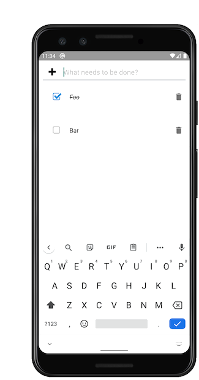

# React Native Todo App (using React Hooks)

A [React Native](https://reactnative.dev/) Todo App, which uses [React Hooks](https://reactjs.org/docs/hooks-intro.html) to manage and persist state via `createContext`, `useReducer`, `useEffect`, and `useState`. Also uses [React Native Elements](https://react-native-elements.github.io/react-native-elements/).

## Building and running

1. `yarn`
1. `yarn start`
1. Once started, press `w` for Web (automatically opens in a browser), `a` for Android or `i` for iOS.

### Run tests via [Jest](https://jestjs.io/)

1. `yarn test`

## Running on a real device

### Android

Download: [ReactNativeTodo.apk](https://exp-shell-app-assets.s3.us-west-1.amazonaws.com/android/%40sebflipper/ReactNativeTodo-059d54694cc4412084d31feb7a1ce2fb-signed.apk), open and allow installation from Unknown Sources, press Open once installed.

## Additional work

* Investigate testing the `dispatch` and `list` within the `useContext` as well as the `useEffect` in `<TodoStoreProvider />`.
* Use [Appium](http://appium.io/) or similar to write functional end to end tests that runs on a real/emulated device, to test real world scenarios.
* Investigate cloud syncing.
* Import and export.
* Investigate making the delete icon swipeable or touch area bigger.
* Dark mode.
* Delete completed.
* Filtering (completed/incomplete).

## Screenshot

